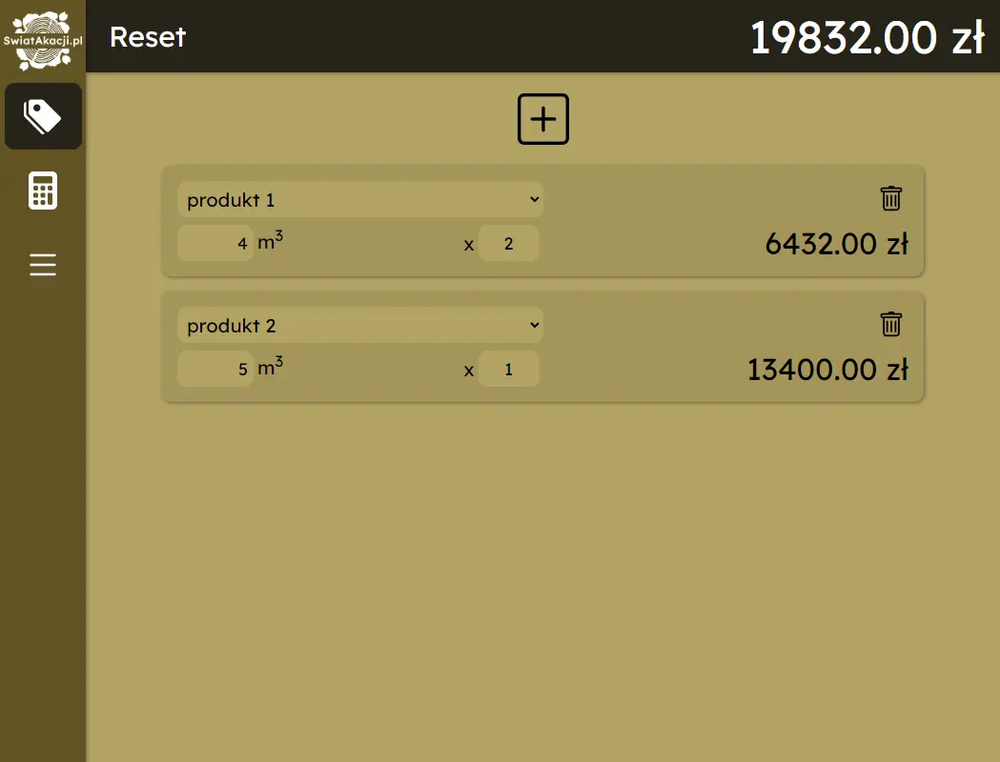

# Akacjowy Kalkulator

Desktop app made for SwiatAkacji.pl with Electron. Lets user store products and calculate their prices.

## Run Locally

Clone the project

```bash
  git clone https://github.com/fykyby/akacjowy-kalkulator.git
```

Go to the project directory

```bash
  cd akacjowy-kalkulator
```

Install dependencies

```bash
  yarn install
```

Start the server

```bash
  yarn electron:serve
```

## Screenshots


